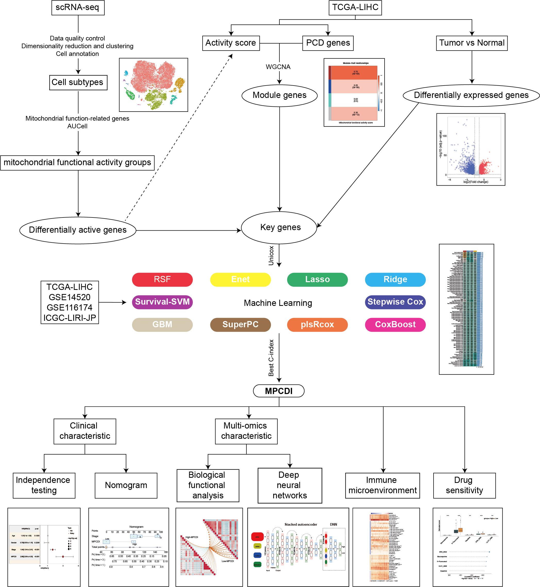

# ML_code
**#101 Machine Learning Algorithms for Combining Models**

RSF (Random Survival Forest) is a method for survival analysis based on random forests, designed to predict survival time or status. It extends traditional Random Forest techniques to handle right-censored survival data with high-dimensional features and interaction terms. RSF has two key parameters: ntree and nodesize. The ntree parameter represents the number of trees constructed, where increasing the number of trees typically enhances model accuracy but also increases computational cost. The nodesize parameter defines the minimum number of observations per leaf node, controlling the depth of tree growth—larger values result in smaller trees.

The Enet, Lasso, and Ridge models are implemented using the glmnet package, with the regularization parameter λ determined via cross-validation. The L1-L2 trade-off parameter α is set within the range 0-1, with an interval of 0.1. The stepwise Cox model is implemented through the survival package using the stepwise algorithm based on the Akaike Information Criterion (AIC). The direction mode of the stepwise search is set to “both,” “backward,” or “forward.”

The CoxBoost model is constructed using the CoxBoost package, fitting a Cox proportional hazards model via a partial likelihood boosting approach. The optimal penalty parameter, which controls model reduction and balances model complexity with fit, is determined using the optimCoxBoostPenalty function. Once this parameter is set, the number of boosting steps, which influences model complexity and performance, is chosen using the cv.CoxBoost function. The final CoxBoost model is then built with the parameters optimized in the earlier steps, ensuring robust performance and interpretability for high-dimensional survival data.

The plsRcox model is implemented with the plsRcox package, where the cv.plsRcox function determines the number of required components, and the plsRcox function fits a generalized linear model with partial least squares regression. The SuperPC model, implemented through the superpc package, generalizes principal component analysis to produce linear combinations of features that capture the directions of maximum variance in the dataset. The superpc.cv function uses cross-validation to estimate optimal feature thresholds for supervised principal components, employing a pre-validation approach to address the challenges of fitting Cox models with small validation datasets.

The GBM (Generalized Boosted Model) is implemented with the gbm package, where cross-validation selects the number of decision trees that minimize cross-validation error, and the gbm function fits a generalized boosted regression model. The Survive-SVM model, implemented using the survivalsvm package, combines support vector machine classification with survival analysis, incorporating censoring into the formulation of inequality constraints in the support vector problem. The model uses cross-validation to optimize parameters, effectively capturing significant features and predicting survival outcomes.

Finally, these methods together form a comprehensive machine learning framework that integrates 10 different algorithms, resulting in 101 unique model combinations.

**#Deep Neural Networks**

We obtained differential expression matrices for mRNA, miRNA, lncRNA, and methylation data between high and low MPCDI subtypes using FDR<0.05 as the criterion. For each data type, we retained the 100 most relevant features as markers associated with HCC-specific cell death. Subsequently, an artificial neural network with stacked autoencoders was used to learn the feature structure and reduce the number of markers to 20 for each data type. Using a deep neural network, a predictor of cell death feature was constructed from 20 markers derived from each molecular layer. Ultimately, based on 80 specific cell death markers from four data types, we trained a deep neural network of cell death feature (DNNCDF) model.

The full code data information for this thesis is shown below
